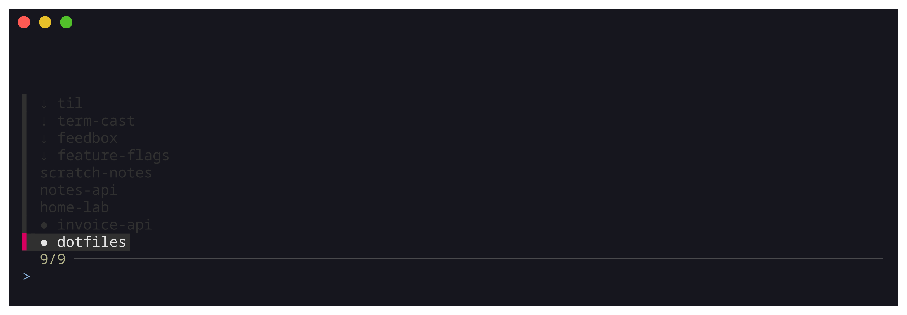
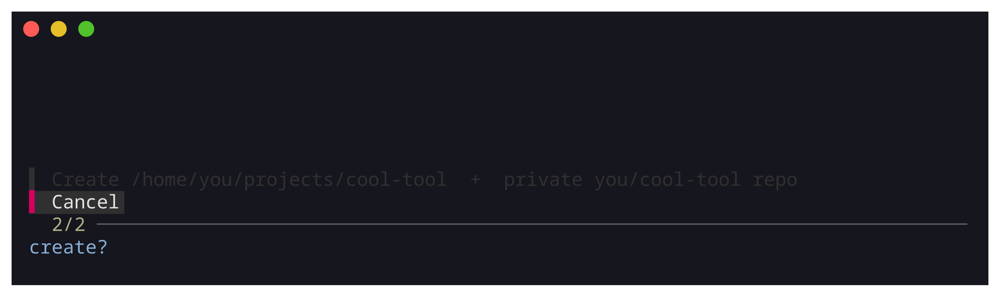

# herdr-pick

One fzf prompt for every place you work in [herdr](https://herdr.dev):
open workspaces, local projects, and not-yet-cloned GitHub repos. Pick
one and it is on screen, focused, laid out with an agent pane next to an
editor pane. Type a new name and it creates the project (and a private
GitHub repo) after a confirm.



It is a single bash script plus a cache refresher. No plugins, no
daemon, nothing to build.

## How it works

```
prefix+s ─▶ herdr-pick (fzf, in a temporary herdr pane)
             ├─ ● open workspace ────▶ herdr workspace focus
             ├─ local project ───────▶ workspace create + editor pane split
             ├─ ↓ cached GitHub repo ▶ gh repo clone ─▶ open like a project
             └─ typed new name ──────▶ confirm ─▶ mkdir + gh repo create ─▶ open
                            ▲
pick-repos-refresh.timer ───┘  ~/.cache/pick/repos (gh repo list, every 30min)
```

Three tiers, deduped by name, so a thing only ever shows once, in its
highest-fidelity tier:

| tier | shows | picking it |
|------|-------|------------|
| `● <name>` | open herdr workspaces | focus it |
| `<name>` | local project dirs that are not open | open a workspace rooted there |
| `↓ <name>` | GitHub repos, from a local cache, not yet cloned | clone (owner decides where), then open |

A typed name that matches nothing is a **create** request: the prefix
before `/` (or a bare name) selects a site from `PICK_SITES`, which says
where the project lives and which GitHub owner gets the auto-created
private repo (or `-` for local only). The confirm dialog defaults to
Cancel, so a reflexive Enter never creates anything.



Opening a workspace lays out two panes: an empty shell on the left for
your coding agent, and your editor (`PICK_EDIT_CMD`, default `nvim .`)
on the right. The `--label` herdr gets is the dedup key for the next
run, and `--focus` is load-bearing: a CLI create does not focus by
default, and the picker should leave you in the new workspace.

## Requirements

- [herdr](https://herdr.dev) (the picker runs in a temporary herdr pane)
- `fzf`, `jq`, `git`, `gh` (with `gh auth login` done once)

## Install, plain

```sh
git clone https://github.com/alect3/herdr-pick
cd herdr-pick
./install.sh
```

`install.sh` copies the scripts into `~/.local/bin`, seeds
`~/.config/herdr-pick/pick.conf` (never overwriting one that exists),
and enables the systemd `--user` timer that keeps the repo cache fresh.
It does not install the requirements.

Then bind it inside herdr, in `~/.config/herdr/config.toml`:

```toml
[[keys.command]]
key = "prefix+s"
type = "pane"
command = "/home/you/.local/bin/herdr-pick"   # absolute path is safest
description = "pick a workspace or project"
```

and nudge a running server: `herdr server reload-config`. Open herdr,
press `prefix+s`.

## Install, with Salt (local)

The repo is also a working Salt formula: the root doubles as a Salt
`file_root` and `herdr-pick/` is the formula. The whole management
surface is one state file, and it runs fine against a throwaway
`salt-call --local`, no master, no root:

```sh
git clone https://github.com/alect3/herdr-pick
cd herdr-pick
salt-call --local --config-dir="$PWD/salt-local" \
  --file-root="$PWD" state.apply herdr-pick
```

`salt-local/minion` is a minimal config that points Salt's cache, log
and socket dirs at /tmp, because a system-wide Salt install ships
root-owned ones that an unprivileged `salt-call` cannot write. The
formula itself only writes into your `$HOME`: the two scripts into
`~/.local/bin`, the example config into `~/.config/herdr-pick/pick.conf`
(`replace: False`, so your edits are never clobbered by re-runs), and
the systemd `--user` units, enabled with a `cmd.run` gated by
`onchanges` (there is no `service.running` for `--user` units).

Running it as root instead, for another user, with package installation
opted in:

```sh
sudo salt-call --local --file-root="$PWD" \
  pillar='{"herdr_pick": {"user": "you", "home": "/home/you",
                          "install_pkgs": true}}' \
  state.apply herdr-pick
```

(Package names vary by distro, so the list is pillar-overridable too,
via `herdr_pick:pkgs`; gh is `github-cli` on Arch.)

## The Salt formula

This is the actual formula shipped in this repo, `herdr-pick/init.sls`,
verbatim. It was extracted from a Salt-managed homelab fleet, where the
same states run from a fileserver formula with pillar-supplied
user/home and a fleet-specific `pick.conf`.

```sls
# herdr-pick, Salt formula for the herdr workspace + project picker.
#
# https://github.com/alect3/herdr-pick
#
# Deploys the picker and its repo-cache refresher into your $HOME, seeds
# an example config, and enables the systemd --user timer that keeps the
# cache fresh. It intentionally does NOT manage your herdr config.toml -
# that file is yours; see the README for the one keybinding snippet to
# add by hand.
#
# Run it from a checkout of this repo, as your own user (everything
# lives in $HOME, so no root is needed):
#
#   salt-call --local --file-root="$PWD" state.apply herdr-pick
#
# fzf/jq/git/gh must already be installed (your package manager), or run
# this as root with package installation opted in:
#
#   sudo salt-call --local --file-root="$PWD" --local \
#     pillar='{"herdr_pick": {"user": "alec", "home": "/home/alec",
#                             "install_pkgs": true}}' \
#     state.apply herdr-pick
#
# (Package names vary by distro, gh is "github-cli" on Arch, so the
# list is pillar-overridable via herdr_pick:pkgs.)
#
# The formula takes user/home/group from the environment with pillar
# overrides. In a real fleet setup (this repo was extracted from one)
# the same states run from a fileserver formula with pillar-supplied
# values and no environment defaults.






# Package installation is opt-in: pkg.installed needs root, while the
# rest of this formula is designed to run unprivileged. Defaults match
# the Debian/Ubuntu names; override the whole list via herdr_pick:pkgs
# for your distro (Arch: fzf jq git github-cli).


herdr-pick-pkg-{{ pkg }}:
  pkg.installed:
    - name: {{ pkg }}



{{ home }}/.local/bin/herdr-pick:
  file.managed:
    - source: salt://herdr-pick/files/herdr-pick.sh
    - user: {{ user }}
    - group: {{ group }}
    - mode: '0755'
    - makedirs: True

{{ home }}/.local/bin/pick-repos-refresh:
  file.managed:
    - source: salt://herdr-pick/files/pick-repos-refresh.sh
    - user: {{ user }}
    - group: {{ group }}
    - mode: '0755'
    - makedirs: True

# Seed the config but never clobber one: replace: False writes the
# example only if the path does not exist yet, so user edits stick (and
# formula updates don't stomp them). Delete the file to re-seed.
{{ home }}/.config/herdr-pick/pick.conf:
  file.managed:
    - source: salt://herdr-pick/files/pick.conf
    - user: {{ user }}
    - group: {{ group }}
    - mode: '0644'
    - makedirs: True
    - replace: False

{{ home }}/.config/systemd/user/pick-repos-refresh.service:
  file.managed:
    - source: salt://herdr-pick/files/pick-repos-refresh.service
    - user: {{ user }}
    - group: {{ group }}
    - mode: '0644'
    - makedirs: True

{{ home }}/.config/systemd/user/pick-repos-refresh.timer:
  file.managed:
    - source: salt://herdr-pick/files/pick-repos-refresh.timer
    - user: {{ user }}
    - group: {{ group }}
    - mode: '0644'
    - makedirs: True

# There's no service.running for --user units, so enablement is a cmd.run
# as the user, gated by onchanges on the unit files (re-runs
# daemon-reload + enable whenever a unit changes). XDG_RUNTIME_DIR lets
# `systemctl --user` reach the user manager; it's derived at run time so
# the state also renders on hosts without the user. `start --no-block`
# warms the cache now without failing the state when the keyring is
# locked (a blocking start of the oneshot would exit non-zero).
herdr-pick-pick-repos-refresh-enable:
  cmd.run:
    - name: |
        export XDG_RUNTIME_DIR="${XDG_RUNTIME_DIR:-/run/user/$(id -u {{ user }})}"
        systemctl --user daemon-reload
        systemctl --user enable --now pick-repos-refresh.timer
        systemctl --user start --no-block pick-repos-refresh.service
    - runas: {{ user }}
    - onchanges:
      - file: {{ home }}/.config/systemd/user/pick-repos-refresh.service
      - file: {{ home }}/.config/systemd/user/pick-repos-refresh.timer
    - require:
      - file: {{ home }}/.local/bin/pick-repos-refresh
```

## Configure

Out of the box (no config file at all): projects live in `~/projects`,
the repo cache lists your authenticated gh user's repos, and a typed
bare name creates `~/projects/<name>` with a private repo under your own
account.

Everything is tuned through one plain-shell file,
`~/.config/herdr-pick/pick.conf` (override the path with
`HERDR_PICK_CONF`). It is sourced by both scripts; every knob is
optional. A three-namespace setup, personal / org / sandbox:

```sh
# Destinations: "name:dir:owner". The FIRST site takes bare names and is
# the fallback clone dir; every name doubles as a create prefix (matched
# case-insensitively). owner "-" = local only; empty = default owner.
PICK_SITES=(
  "projects:$HOME/projects:"          # bare names: ~/projects, your repo
  "work:$HOME/work:acme-org"          # work/…:    ~/work, acme-org repo
  "w:$HOME/work:acme-org"             # shorthand for the same site
  "r:$HOME/sandbox:-"                 # r/…:       ~/sandbox, local only
)

# Owners for the repo cache (the ↓ tier), in precedence order: earlier
# owners win a basename clash. Empty = your authenticated gh user.
PICK_OWNERS=(you acme-org)

# Clone-dir overrides for owners the site table does not already map.
PICK_OWNER_DIR[acme-org]="$HOME/work"

# Default owner for sites with an empty owner field. Unset = `gh api
# user`, queried lazily, only when a create is actually requested.
PICK_DEFAULT_OWNER=you

# Editor pane command (left pane stays an empty shell for your agent).
# Default "nvim ." when nvim exists; skipped when the binary is missing;
# set empty for a plain shell.
PICK_EDIT_CMD="nvim ."
```

The shipped `herdr-pick/files/pick.conf` is the same list, fully
commented, and the formula/`install.sh` seed it without ever overwriting
your edits.

## The repo cache

`herdr-pick` never calls `gh` while you are picking: the ↓ tier reads
`~/.cache/pick/repos`, one `owner/repo` per line, which
`pick-repos-refresh` rebuilds (a systemd `--user` timer fires it shortly
after login and then every 30 minutes, and the picker kicks it after a
clone or create). The refresh is atomic and keep-last-good: if a listing
fails (locked keyring, offline), the previous cache stays in place and
the menu just gets a stale-but-correct clone tier instead of an empty
one.

## Tests

```sh
bats test/
```

29 tests cover the pure config resolution (`parse_destination`,
`clone_dest`, `resolve_default_owner`), the refresh's keep-last-good
behaviour with `gh` stubbed, and the full dispatch end-to-end with
`herdr`, `fzf` and `gh` stubbed (jq stays real, parsing the stub
responses). CI runs the same suite plus `shellcheck` on every PR.

## Origin

Extracted from a Salt-managed homelab fleet (the retired fuzzel/niri
picker before that), where it has been the front door to every work
session for a while. The fleet formula that consumes this repo lives in
the private Salt state repo; this repo is the tool itself, plus the
formula you see above for everyone else.
